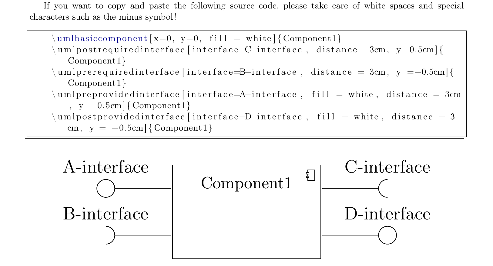

# TIkZ-UML Component Diagram Interface Connector

A small extension to TikZ UML that allows you to change the Y coordinate for interfaces. This allows you to add multiple interfaces to a single component and choose their location yourself.

# Usage
## [Example in LaTeX](Examples/component_diagram.tex)
```
\umlbasiccomponent[x=0, y=0, fill = white]{Component1}
\umlpostrequiredinterface[interface=C-interface, distance= 3cm, y=0.5cm]{Component1}
\umlprerequiredinterface[interface=B-interface, distance = 3cm, y =-0.5cm]{Component1}
\umlpreprovidedinterface[interface=A-interface, fill = white, distance = 3cm, y =0.5cm]{Component1}
\umlpostprovidedinterface[interface=D-interface, fill = white, distance = 3cm, y = -0.5cm]{Component1}
```

## [Example in PDF](Examples/component_diagram.pdf)

